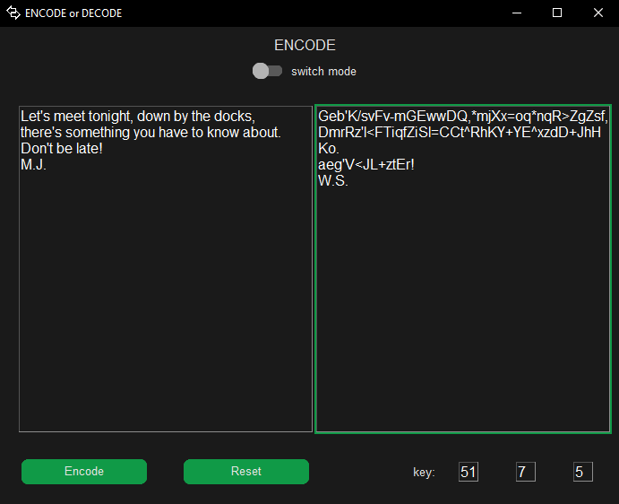
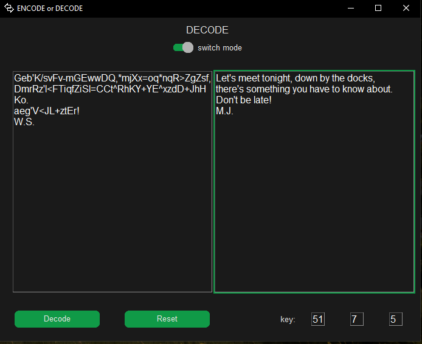

# EncodeDecode

EncodeDecode is a software made in Python using the Tkinter module (including customTkinter by Tom Schimansky).  
The app is designed to encode and decode text/strings securely.

---

## Screenshots

  
  

---

## Features

- Clean and simple design
- High-level encryption
- Inspired by the Enigma machine
- Uses randomized settings for decoding (provided at the time of encoding)

---

## Authors

- [@mjospovich](https://github.com/mjospovich)
- [@ldoric](https://github.com/ldoric)
- [@DStojanac](https://github.com/DStojanac)

---

## License

This project is licensed under the MIT License. You can find the full license text in the [LICENSE](./LICENSE) file.
